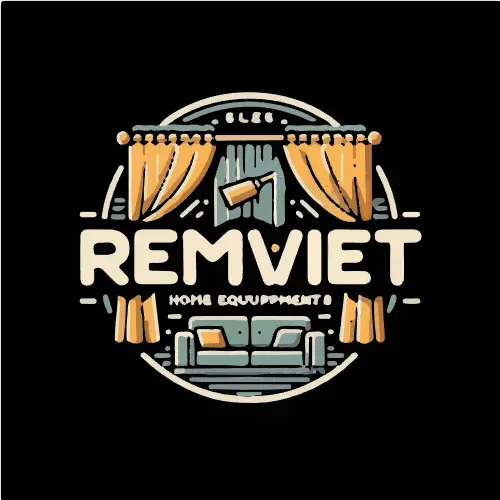
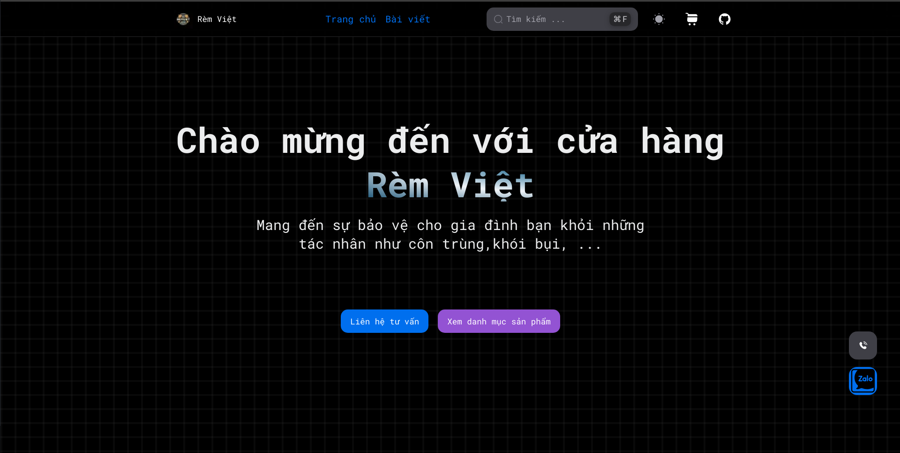
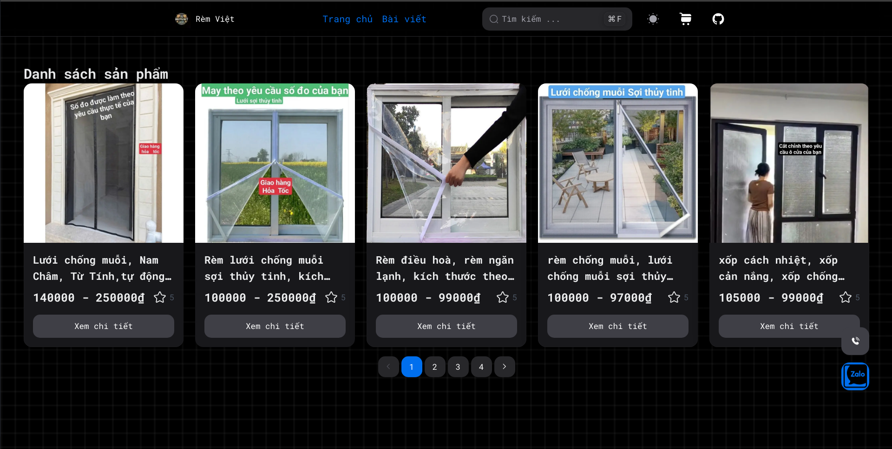
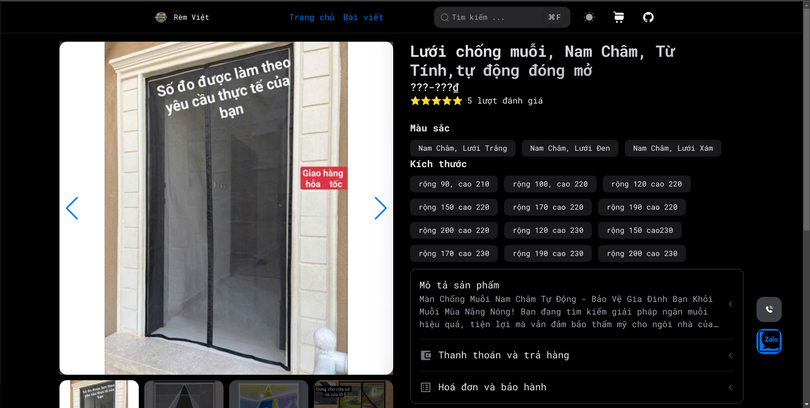
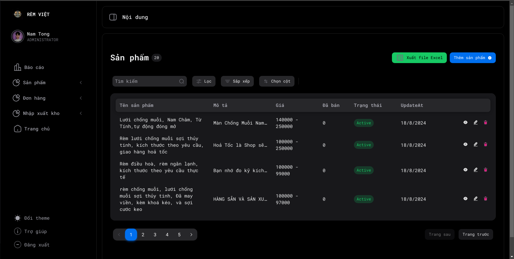

<a id="readme-top"></a>

[![Contributors][contributors-shield]][contributors-url]
[![Forks][forks-shield]][forks-url]
[![Stargazers][stars-shield]][stars-url]
[![Issues][issues-shield]][issues-url]
[![MIT License][license-shield]][license-url]
[![LinkedIn][linkedin-shield]][linkedin-url]


<!-- PROJECT LOGO -->
<br />
<div align="center">
  <a href="https://github.com/tongducthanhnam/rem-viet">
  
  </a>

<h3 align="center">Rèm Việt</h3>
  <div >
  <p align="center"> 
    A Full-stack E-commerce website for selling curtains and blinds. Frontend is built with ReactJS, Backend is built with NodeJS, ExpressJS, MongoDB.
  </p>    
    <br />
    <a href="https://github.com/TongDucThanhNam/rem-viet">
      <strong>Explore the docs »</strong>
    </a>
    <br />
    <br />
    <a href="https://github.com/TongDucThanhNam/rem-viet">View Demo</a>
    ·
    <a href="https://github.com/TongDucThanhNam/rem-viet/issues/new?labels=bug&template=bug-report---.md">Report Bug</a>
    ·
    <a href="https://github.com/TongDucThanhNam/rem-viet/issues/new?labels=enhancement&template=feature-request---.md">
      Request Feature</a>
    </div>
</div>


<!-- TABLE OF CONTENTS -->
<details>
  <summary>Table of Contents</summary>
  <ol>
    <li>
      <a href="#about-the-project">About The Project</a>
      <ul>
        <li><a href="#built-with">Built With</a></li>
      </ul>
    </li>
    <li>
      <a href="#getting-started">Getting Started</a>
      <ul>
        <li><a href="#prerequisites">Prerequisites</a></li>
        <li><a href="#installation">Installation</a></li>
      </ul>
    </li>
    <li><a href="#usage">Usage</a></li>
    <li><a href="#roadmap">Roadmap</a></li>
    <li><a href="#contributing">Contributing</a></li>
    <li><a href="#license">License</a></li>
    <li><a href="#contact">Contact</a></li>
    <li><a href="#acknowledgments">Acknowledgments</a></li>
  </ol>
</details>

## About The Project

[//]: # (Here's a blank template to get started: To avoid retyping too much info. Do a search and replace with your text editor for the following: `github_username`, `repo_name`, `twitter_handle`, `linkedin_username`, `email_client`, `email`, `project_title`, `project_description`)

## Screenshots

<p align="center">
  
  
  
  
</p>


<div align="right">(<a href="#readme-top">back to top</a>)
</div>

### Built With

[![Next][Next.js]][Next-url]
[![React][React.js]][React-url]
[![ExpressJS][Express.js]][Express-url]
[![MongoDB][MongoDB]][MongoDB-url]
[![Docker][Docker]][Docker-url]

<div align="right">
  (<a href="#readme-top">back to top</a>)
</div>


<!-- GETTING STARTED -->

## Getting Started

This is an example of how you may give instructions on setting up your project locally.
To get a local copy up and running follow these simple example steps.

### Prerequisites

Before you begin, ensure you have met the following requirements:  
- NodeJS installed
- Bun installed (npm. yarn or pnpm are okey)
- install concurrently:
  ```sh
  bun add -g concurrently
  ```
- MongoDB installed (or use MongoDB Atlas)
- Docker installed (optional)
- Telegram bot token (optional)
- Prepare the environment variables in the `.env` file in the backend, frontend folder or modifier docker-compose.yml file if you using docker.


### Installation

- Clone the repository:

```
git clone https://github.com/TongDucThanhNam/rem-viet
```

- Install the frontend:

```
cd rem-viet/frontend
bun i
```

- Install the backend:

```
cd rem-viet/backend
bun i
```

- Run all by concurrently:

```
bun run dev
```

- Open your browser and go to `http://localhost:3000` for frontend and `http://localhost:3001` for backend.

- For production (better performance), you can build the frontend and run the backend:

```
bun run build
bun run start
```

- You can also run the backend with Docker:

```
docker compose build
docker compose up
```

<p align="right">(<a href="#readme-top">back to top</a>)</p>


<!-- USAGE EXAMPLES -->

## Usage

[//]: # (Use this space to show useful examples of how a project can be used. Additional screenshots, code examples and demos work well in this space. You may also link to more resources.)

_For more examples, please refer to
the [Documentation](https://github.com/TongDucThanhNam/rem-viet?tab=readme-ov-file)_

<p align="right">(<a href="#readme-top">back to top</a>)</p>


<!-- ROADMAP -->

## Roadmap
- [x] Basic Frontend and Backend
- [x] Deploy the project
- [x] Dashboard for admin
- [ ] Blog feature
- [ ] Order management and Payment
- [ ] Add more advanced features
- [ ] Improve the UI/UX and performance

See the [open issues](https://github.com/TongDucThanhNam/rem-viet/issues) for a full list of
proposed features (and known issues).

<p align="right">(<a href="#readme-top">back to top</a>)</p>


<!-- CONTRIBUTING -->

## Contributing

Contributions are what make the open source community such an amazing place to learn, inspire, and
create. Any contributions you make are **greatly appreciated**.

If you have a suggestion that would make this better, please fork the repo and create a pull
request. You can also simply open an issue with the tag "enhancement".
Don't forget to give the project a star! Thanks again!

1. Fork the Project
2. Create your Feature Branch (`git checkout -b feature/AmazingFeature`)
3. Commit your Changes (`git commit -m 'Add some AmazingFeature'`)
4. Push to the Branch (`git push origin feature/AmazingFeature`)
5. Open a Pull Request

<p align="right">(<a href="#readme-top">back to top</a>)</p>

### Top contributors:

<a href="https://github.com/TongDucThanhNam/rem-viet/graphs/contributors">
  
</a>


<!-- LICENSE -->

## License

Distributed under the MIT License. See `LICENSE` for more information.

<p align="right">(<a href="#readme-top">back to top</a>)</p>


<!-- CONTACT -->

## Contact

[@tongducthanhnam](https://twitter.com/tongducthanhnam) - tongducthanhnam@gmail.com

[My Portfolio](https://tongducthanhnam.id.vn)

<p align="right">(<a href="#readme-top">back to top</a>)</p>

<!-- What I have learn -->
## What I have learned
- Backend with NodeJS and ExpressJS
  - RESTful API witb ExpressJS: Routing, Middleware
  - MongoDB with Mongoose: CRUD, Model with schema
  - Clean architecture: Controller, Service, Repository
  - Swagger for API documentation: Swagger-autogen
  - Send message to Telegram bot
- Frontend with NextJS and ReactJS
  - NextJS with ReactJS: app routing structure, dymanic routing, Fetch, SSR, ...
  - ReactJS: useState, useEffect,
  - TailwindCSS: Styling
  - NextUI: Using components
  - Frammer Motion: Animation
- Dockerize the project


<!-- ACKNOWLEDGMENTS -->

## Acknowledgments

* [NextUI](https://nextui.org)
* [MongoDB](https://mongodb.com)
* [ExpressJS](https://expressjs.com)
* [ReactJS](https://reactjs.org)
* [NodeJS](https://nodejs.org)
* [Next.js](https://nextjs.org)
* [Docker](https://docker.com)


<p align="right">(<a href="#readme-top">
  back to top
</a>)</p>


<!-- MARKDOWN LINKS & IMAGES -->
<!-- https://www.markdownguide.org/basic-syntax/#reference-style-links -->

[contributors-shield]: https://img.shields.io/github/contributors/tongducthanhnam/rem-viet.svg?style=for-the-badge

[contributors-url]: https://github.com/tongducthanhnam/rem-viet/graphs/contributors

[forks-shield]: https://img.shields.io/github/forks/tongducthanhnam/rem-viet.svg?style=for-the-badge

[forks-url]: https://github.com/tongducthanhnam/rem-viet/network/members

[stars-shield]: https://img.shields.io/github/stars/tongducthanhnam/rem-viet.svg?style=for-the-badge

[stars-url]: https://github.com/tongducthanhnam/rem-viet/stargazers

[issues-shield]: https://img.shields.io/github/issues/tongducthanhnam/rem-viet.svg?style=for-the-badge

[issues-url]: https://github.com/tongducthanhnam/rem-viet/issues

[license-shield]: https://img.shields.io/github/license/tongducthanhnam/rem-viet.svg?style=for-the-badge

[license-url]: https://github.com/tongducthanhnam/rem-viet/blob/main/LICENSE

[linkedin-shield]: https://img.shields.io/badge/-LinkedIn-black.svg?style=for-the-badge&logo=linkedin&colorB=555

[linkedin-url]: https://linkedin.com/in/tong-duc-thanh-nam

[//]: # ([product-screenshot]: images/screenshot.png)


[Next.js]: https://img.shields.io/badge/next.js-000000?style=for-the-badge&logo=nextdotjs&logoColor=white

[Next-url]: https://nextjs.org/

[React.js]: https://img.shields.io/badge/React-20232A?style=for-the-badge&logo=react&logoColor=61DAFB

[React-url]: https://reactjs.org/

[Express.js]: https://img.shields.io/badge/express.js-%23404d59.svg?style=for-the-badge&logo=express&logoColor=%2361DAFB

[Express-url]: https://expressjs.com

[MongoDB]: https://img.shields.io/badge/MongoDB-%234ea94b.svg?style=for-the-badge&logo=mongodb&logoColor=white

[MongoDB-url]: https://mongodb.com

[Docker]:https://img.shields.io/badge/docker-%230db7ed.svg?style=for-the-badge&logo=docker&logoColor=white

[Docker-url]: https://docker.com


